# spring-boot-kafka-demo

### Things to do:

1. Clone this repository: `git clone https://github.com/hendisantika/spring-boot-kafka-demo.git`
2. Navigate to the folder: `cd spring-boot-kafka-demo`
3. Make sure your ZooKeeper & Kafka already run
4. Run this command to run ZooKeeper: `bin/zookeeper-server-start.sh config/zookeeper.properties`
5. Run this command to run Kafka: `bin/kafka-server-start.sh config/server.properties`
6. Run the application: `mvn clean spring-boot:run`
7. Publish message to kafka topic:

```shell
curl --location --request POST 'http://localhost:8082/api/kafka/publish' \
--header 'topic-name: book-update' \
--header 'Content-Type: application/json' \
--data-raw '{
    "message": "Testing1"
}'
```

8. Publish message to kafka topic:

```shell
curl --location --request POST 'http://localhost:8082/api/kafka/books/publish' \
--header 'topic-name: book-update' \
--header 'Content-Type: application/json' \
--data-raw '{
    "bookName": "Spring Boot Tutorial",
    "author": "Hendi Santika"
}'
```

This simple application connects to a kafka cluster installed on your local machine and publishes and subscribes
messages from a kafka topic.

- [Local kafka setup](#local-kafka-setup)
- [Testing local kafka using command line tools](#testing-local-kafka-using-command-line-tools)
- [Kafka Tool setup](#kafka-tool-setup)
- [Sending message using Kafka Tool UI](#sending-message-using-kafka-tool-UI)
- [Publishing and subscribing to kafka topic](#publishing-and-subscribing-to-kafka-topic)
- [Find the program using a specific port](#Find-the-program-using-a-specific-port)

## Local kafka setup

The steps outlined below are for MAC users.

1. `brew install kafka`
2. Start zookeeper using brew services: `brew services start zookeeper`

   If you don't want to run it as a background service you can just
   run : `zookeeper-server-start /usr/local/etc/kafka/zookeeper.properties`
3. Now start kafka using brew services: `brew services start kafka`

   If you don't want to run it as a background service you can just
   run : `kafka-server-start /usr/local/etc/kafka/server.properties`
4. To view the services: `brew services list`
5. To stop zookeeper & kafka using brew services

   ```
    brew services stop zookeeper
    brew services stop kafka
   ```

***NOTE: Brew services will keep the services running in the background. So the services will be running at all
times.***

## Testing local kafka using command line tools

In this section we will create a topic, a producer and a consumer and test the flow using kafka command line tools.

1. Create a topic named `book-update`

   `kafka-topics --create --zookeeper localhost:2181 --replication-factor 1 --partitions 1 --topic book-update`
   or `bin/kafka-topics.sh --create --partitions 1 --replication-factor 1 --topic book-update --bootstrap-server localhost:9092`

2. Create Producer console and send messages to the topic `book-update`

   `kafka-console-producer --broker-list localhost:9092 --topic book-update`
   or `bin/kafka-console-producer.sh --topic book-update --bootstrap-server localhost:9092`

   You will see `>` once you run the above command. Now you can type in the messages that you want to send. An example
   is shown below.

   ```
   >First book update
   >Second book update
   ```
3. Create Consumer console which will listen to localhost at port 9092 at topic `book-update`

   `kafka-console-consumer --bootstrap-server localhost:9092 --topic book-update --from-beginning`
   or `bin/kafka-console-consumer.sh --topic book-update --from-beginning --bootstrap-server localhost:9092`

   Example output of the above command

   ```
    First book update
    Second book update
   ```

## Kafka Tool setup

We are going to use Kafka Tool as a GUI for managing and using Kafka cluster. It is a free tool as long as you are not
using it for commercial purposes.

***NOTE: Do not use this tool for any commercial purposes without purchasing a license***

1. Download link for the tool - https://www.kafkatool.com/download.html
2. Once you have installed the software on your machine open the tool to setup the connection details.
   ```
   Zookeeper Host : localhost
   Zookeeper Port : 2181
   ```
   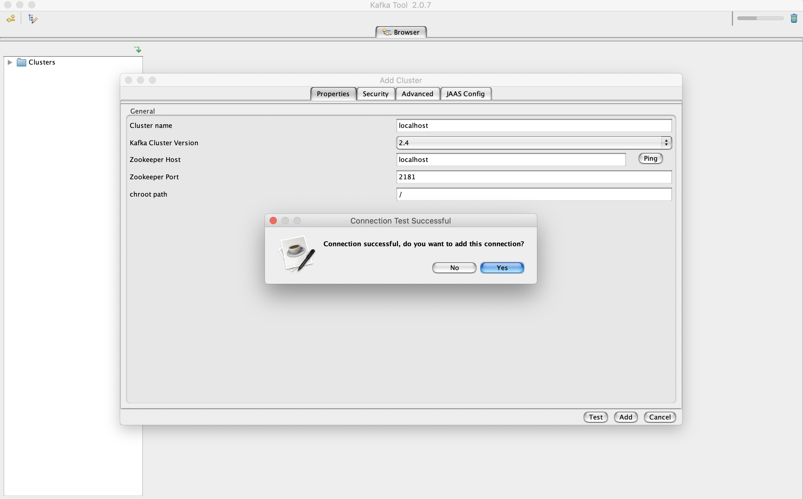

3. Inside topics section you will see the `book-update` topic that we created earlier with the command line tool. Click
   on the Data tab and click on `Retrieve messages` which looks like a play button to see the messages added earlier.
   Notice that by default the messages are displayed in bytes. In the next step we will convert it to string.

   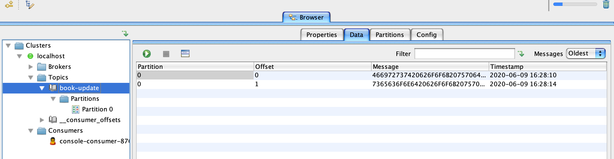

4. To change from byte to string switch over to the properties tab and change both key and message to string and click
   update as show in the below screenshot.
   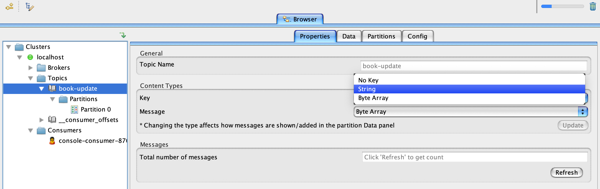

5. Messages displayed in string.
   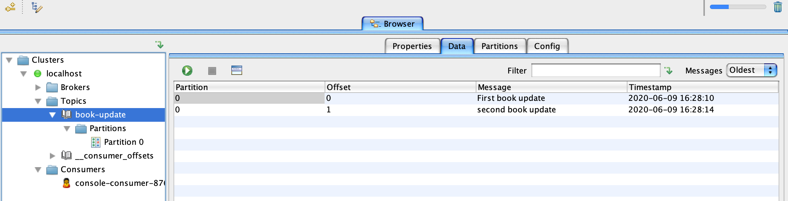

## Sending message using Kafka Tool UI

Now let's try to send a message using Kafka Tool UI.

1. Click on partition 0 under your topic name and then switch over to the Data tab and click on the plus sign and add
   single message.
   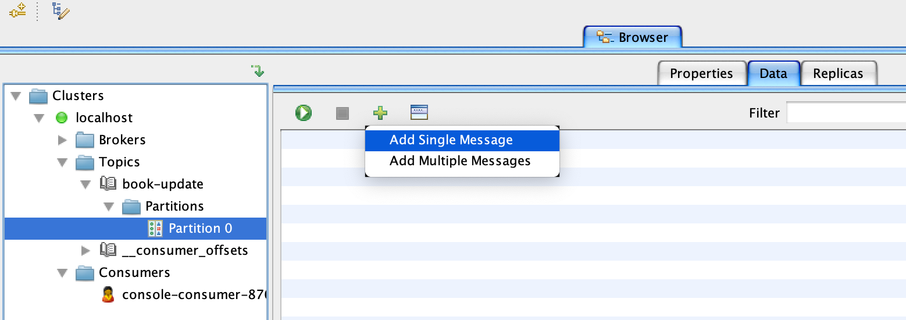

2. For both `key` and `value` section switch from `from file` to `Enter manually [HEX]`. In the below screenshot example
   i didn't give a value for `key`. Click on Add and you can keep adding messages if you want to.
   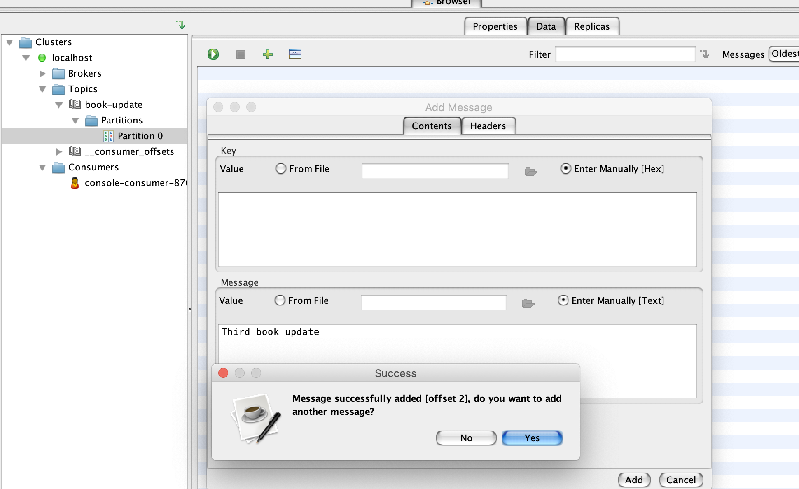

3. Now click on the topic name which in this case is `book-update` and switch to the data tab. Click
   on `Retrieve messages` which looks like a play button to see the new messages added from the previous step.

## Publishing and subscribing to kafka topic

Before running the project let's look at some screenshots from the code base.

1. Check `KafkaConsumerConfig` and `KafkaProducerConfig` classes in `core` package for consumer and producer
   configuration.

2. Check `KafkaConsumer` class in the `service` package for code that cosumes messages from the topic `book-update`. You
   can add consumers for different topics in this class.

   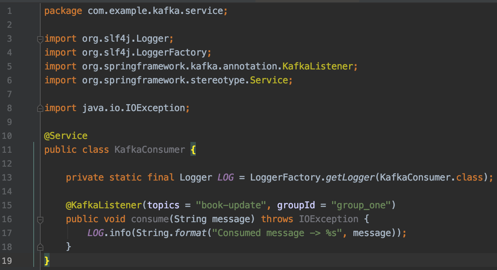

3. spring-boot let's you create topic on a kafka cluster programmatically. Check class `KafkaTopicConfig` in `core`
   package. It will programmatically create a topic with the name you pass to it. Check `kafka.topic.name`
   in `application.properties` file to see the name of the topic we are creating.

   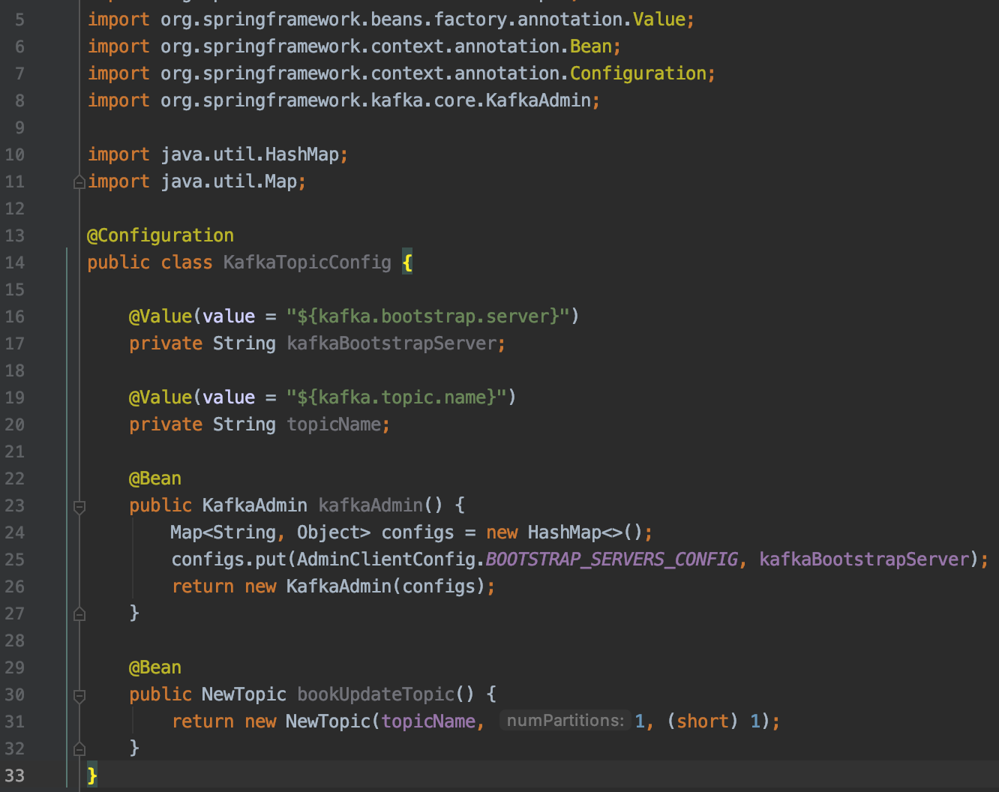

4. we have two REST api's that you can use to publish message to a topic.

   a. POST service that accepts string message as body. You will have to pass a header with the topic name you wish to
   publish the message to.
      ```
       POST : http://localhost:8082/kafka/publish
       HEADER : 
               "key" : "topic-name",
               "value" : "book-update"
      ```
   b. POST service that accepts json as body. The body should match the structure of pojo books. Also you need to pass a
   header with the topic name you wish to publish the message to.
      ```
      POST : http://localhost:8082/kafka/books/publish
      HEADER : 
              "key" : "topic-name",
              "value" : "book-update"
      ``` 

   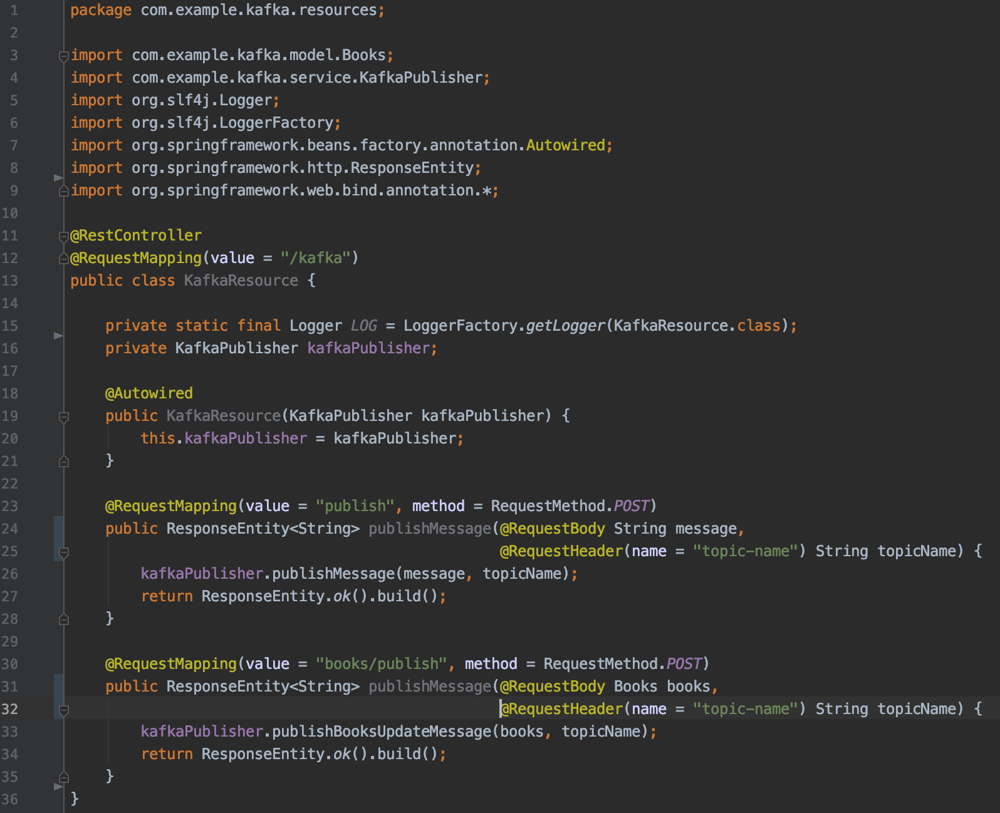

## Running the spring-boot project

we have setup the cluster so let's try to run the project.

1. Clone this git repo

   `git clone github.com/hendisantika/spring-boot-kafka-demo.git`

2. Just take a look at `application.properties` under `resources` folder of the project. By default springboot runs on
   8080 but i changed it to 8082 because our zookeeper was using port 8080.

   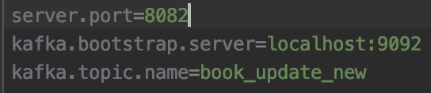

3. Now let's run the project : `mvn clean spring-boot:run`

4. Let's go and look at the kafka tool. You can see that the topic `book_update_new` got created programmatically once
   we ran the app.

   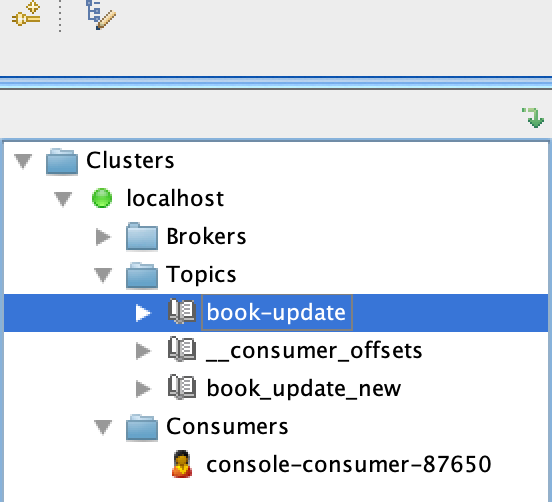

5. Let's publish a message using the REST api. Below screenshot shows an example and don't forget to add the
   header `topic-name` when you hit the service.

   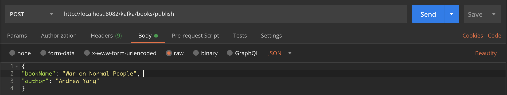

6. If you go back to the window you ran the spring-boot project from you can see the log message from the consumer that
   consumes the message published from the previous post. The below screenshot shows the same.

   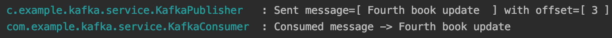

7. This last screenshot is the second REST api if you like to test it out and don't forget to add the
   header `topic-name` when you hit the service.

   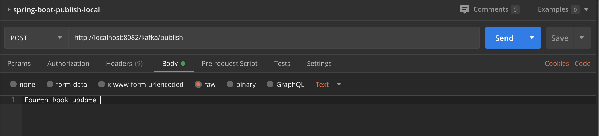

## Find the program using a specific port

This section is just for folks who are curious and want to see more details on the process using a specific port.

1. To find the process id usig a specific port run this command from your terminal
   window : `lsof -i :8080 | grep LISTEN`
2. To get details on the process id : `ps -ef "pid"`
